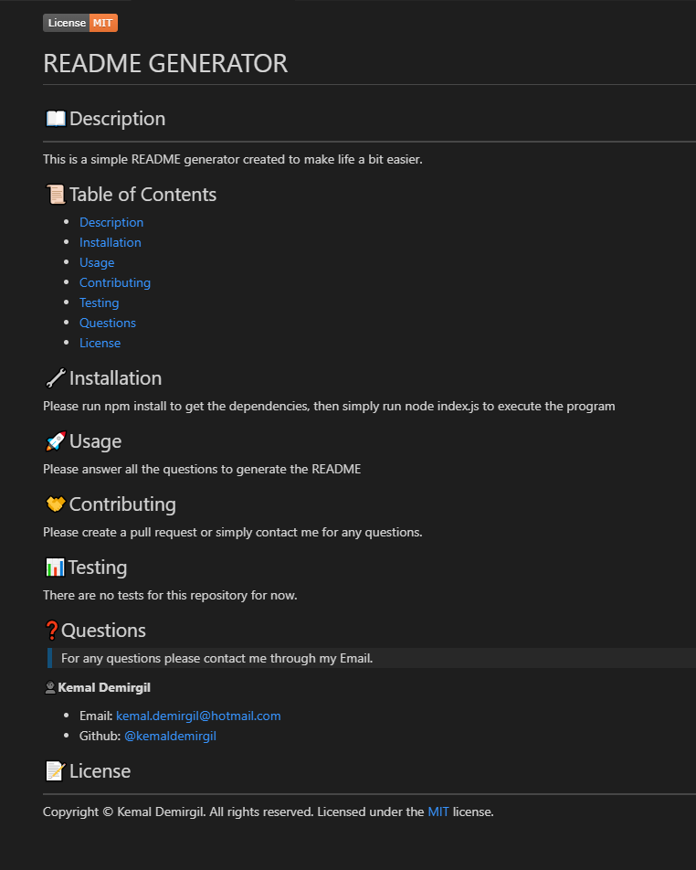

  
  
  
  
  # README GENERATOR

  ## 📖Description
  This is a simple README generator created by using the `Inquirer` & `fs` modules. The program runs on `Node.js` and it was created to make life a bit simpler by generating README files without worrying about syntactical problems that might occur.
  
  ## ✨Demo
  
  #### Generated README:
  
  
  ## 🔧Installation
  Please have `Node.js` and `npm` installed in the computer. Then simply on the parent directory run;
  ```bash
  npm install
  ```
  ## 🚀Usage
  Please start by running  
  ```bash
  node index.js
  ```
  on the <ins>src</ins> directory then; 
  
  1. Enter your name,
  2. Enter the title,
  3. Enter the description,
  4. Enter the installation instructions,
  5. Enter the Usage information,
  6. Select the License,
  7. Select the License badge color,
  8. Enter Contribution guideline,
  9. Enter Test instructions,
  10. Enter Questions information,
  11. Enter your Github username,
  12. Enter your Github repository name,
  13. Enter your Email.

  And the `README.md` file will be generated in the `generated-README` directory.

  ## 🤝Contributing
  This is my first application I've created using `Node.js` and I'm hoping to use it as my first *Open Source* project. Since, I'm still very new to creating *Open Source* projects, I appreciate every contribution and input anyone might have. Pull requests and any other issues are most welcomed, I'm looking to collaborate with creating tests for this application.

  ## 📊Testing
  Unfortunately, as of now, there are no available tests for this application. I'm looking forward to creating some in the future.

  ## ❓Questions
  > Please contact me via Email, I am available anytime to answer any questions there might be.
  
  👤**Kemal Demirgil**

  - Email: kemaldemirgil@hotmail.com
  - Github: [@kemaldemirgil](https://github.com/kemaldemirgil)

  ## 📝License
  Copyright © Kemal Demirgil. All rights reserved. Licensed under the [MIT](https://github.com/kemaldemirgil/README-GENERATOR/blob/main/LICENSE) license.
  
  
